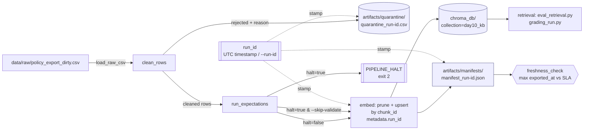

# Kiến trúc pipeline — Lab Day 10

**Nhóm:** 3-E402 
**Cập nhật:** 15/04/2026

---

## 1. Sơ đồ luồng (bắt buộc có 1 diagram: Mermaid / ASCII)

---

## 2. Ranh giới trách nhiệm

| Thành phần | Input | Output | Owner nhóm |
|------------|-------|--------|--------------|
| Ingest | data/raw/policy_export_dirty.csv | rows: list[dict] + raw_records log | Ingestion Owner |
| Transform | rows | cleaned[], quarantine[] + 2 CSV trong artifacts/ | Cleaning Owner |
| Quality | cleaned[] | ExpectationResult[] + cờ halt | Cleaning / Quality Owner |
| Embed | cleaned CSV | Chroma collection day10_kb (upsert + prune) | Embed Owner |
| Monitor | manifest_*.json | PASS/WARN/FAIL + age_hours | Monitoring Owner |

---

## 3. Idempotency & rerun

> - Upsert theo chunk_id. chunk_id được tạo thành bằng cách hash doc_id, chunk_text và seq
> - Rerun 2 lần không duplicate: vì cùng `chunk_id` → `col.upsert` ghi đè, số vector giữ nguyên.

---

## 4. Liên hệ Day 09

> Pipeline này cung cấp / làm mới corpus cho retrieval trong `day09/lab` như thế nào? (cùng `data/docs/` hay export riêng?)

- Export riêng qua Chroma collection `day10_kb` tại `CHROMA_DB_PATH=./chroma_db`, không share `data/docs/`.
- Làm mới: mỗi `python etl_pipeline.py run` → upsert theo `chunk_id` + prune id không còn trong cleaned snapshot.
- Day 09 retrieval trỏ cùng `CHROMA_DB_PATH` + `CHROMA_COLLECTION` để đọc corpus mới nhất.

---

## 5. Rủi ro đã biết

- Đổi EMBEDDING_MODEL giữa các run không được chặn: upsert cùng chunk_id nhưng vector sinh từ model khác → collection trộn 2 không gian vector, retrieval sai mà không có cảnh báo.
- chunk_id phụ thuộc biến seq đếm theo thứ tự quarantine: chỉ cần thêm/bớt 1 row bị quarantine ở đầu file (hoặc đổi thứ tự CSV raw), seq của mọi chunk sau đó bị shift → sinh chunk_id hoàn toàn khác → prune xóa sạch rồi upsert lại toàn bộ. Idempotency bị phá âm thầm
