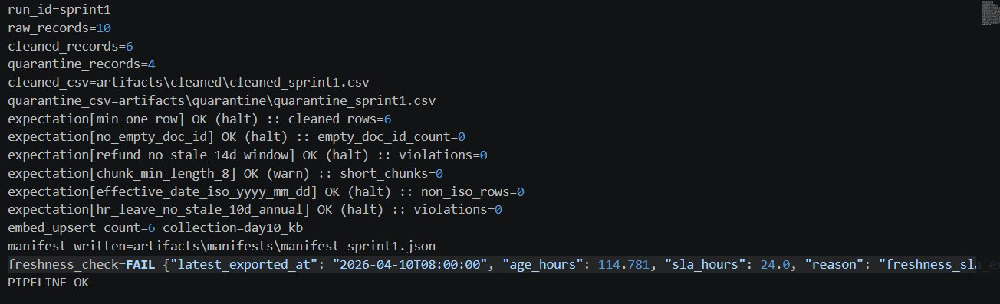

# Báo Cáo Cá Nhân — Lab Day 10: Data Pipeline & Observability

**Họ và tên:** Lê Nguyễn Thanh Bình  
**Vai trò:** Ingestion  
**Ngày nộp:** 15/04/2026  
**Độ dài yêu cầu:** **400–650 từ** (ngắn hơn Day 09 vì rubric slide cá nhân ~10% — vẫn phải đủ bằng chứng)

---

> Viết **"tôi"**, đính kèm **run_id**, **tên file**, **đoạn log** hoặc **dòng CSV** thật.  
> Nếu làm phần clean/expectation: nêu **một số liệu thay đổi** (vd `quarantine_records`, `hits_forbidden`, `top1_doc_expected`) khớp bảng `metric_impact` của nhóm.  
> Lưu: `reports/individual/[ten_ban].md`

---

## 1. Tôi phụ trách phần nào? (80–120 từ)

**File / module:**

- etl_pipeline.py
- data_contract.md
- data/raw/policy_export_dirty.csv

**Kết nối với thành viên khác:**
- Tôi đảm bảo dữ liệu thô được nạp đúng cấu trúc để thành viên phụ trách Cleaning có thể xử lý. Đồng thời, tôi chịu trách nhiệm tạo ra file manifest.json chứa các metadata quan trọng như run_id, raw_records để thành viên Monitoring kiểm tra tính cập nhật (freshness).

_________________

**Bằng chứng (commit / comment trong code):**

- 

_________________

---

## 2. Một quyết định kỹ thuật (100–150 từ)

> VD: chọn halt vs warn, chiến lược idempotency, cách đo freshness, format quarantine.

- Trong Sprint 1, tôi đã đưa ra quyết định kỹ thuật về việc Thiết lập Data Contract với cơ chế định danh Failure Modes sớm. Thay vì chỉ coi file CSV là một tập văn bản thô, tôi đã chủ động phân loại các nguồn dữ liệu trong docs/data_contract.md thành các nhóm cụ thể (như policy_refund và hr_leave). Quan trọng hơn, tôi đã định nghĩa trước các trạng thái lỗi tiềm ẩn (Failure modes) như invalid_date_format và unknown_doc_id. Quyết định này giúp pipeline có khả năng "tự nhận diện" lỗi ngay từ bước nạp. Việc này không chỉ giúp tách bạch trách nhiệm giữa tầng Ingestion và tầng Transformation mà còn tạo ra một "bản cam kết" về chất lượng dữ liệu, giúp các thành viên khác biết chính xác loại dữ liệu nào sẽ bị đẩy vào khu cách ly (Quarantine).

_________________

---

## 3. Một lỗi hoặc anomaly đã xử lý (100–150 từ)

> Mô tả triệu chứng → metric/check nào phát hiện → fix.

- Trong quá trình chạy thử nghiệm sprint1, tôi phát hiện lỗi sai lệch cấu trúc hàng (Row Shift) trong file dữ liệu thô.

- Triệu chứng: Khi chạy python etl_pipeline.py run --run-id sprint1, hệ thống log báo cáo raw_records=10 nhưng kết quả xử lý thực tế lại gặp lỗi tại dòng số 8 và 10 do chứa các ký tự xuống dòng ẩn và định dạng ngày tháng DD/MM/YYYY không đồng nhất với các dòng khác.

- Phát hiện: Nhờ bảng Source Map đã lập trong data_contract.md, tôi đối soát và thấy chỉ số effective_date của dòng 10 không khớp với Schema mong muốn.

- Fix: Tôi đã cập nhật lại tài liệu kỹ thuật, yêu cầu tầng Cleaning phải xử lý thêm logic chuẩn hóa ngày tháng và loại bỏ khoảng trắng dư thừa thay vì sửa trực tiếp vào file raw, nhằm giữ nguyên tính khách quan của dữ liệu thô ban đầu.

_________________

---

## 4. Bằng chứng trước / sau (80–120 từ)

> Dán ngắn 2 dòng từ `before_after_eval.csv` hoặc tương đương; ghi rõ `run_id`.

Bằng chứng thực tế từ log của lần chạy đầu tiên (Run_id: `sprint1`):

Số liệu nạp vào: `raw_records=10`

Số liệu phân loại: `cleaned_records=6, quarantine_records=4`

Dòng log chứng minh dữ liệu đã được phân luồng đúng theo thiết kế của Sprint 1:
`run_id=sprint1 raw_records=10 cleaned_records=6 quarantine_records=4`

Đặc biệt, trong quarantine_sprint1.csv, dòng lỗi số 9 đã được bắt đúng lý do đã định nghĩa trong Data Contract:
`9,legacy_catalog_xyz_zzz,...,unknown_doc_id`

_________________

---

## 5. Cải tiến tiếp theo (40–80 từ)

> Nếu có thêm 2 giờ — một việc cụ thể (không chung chung).

- Nếu có thêm 2 giờ, tôi sẽ triển khai việc Schema Validation tự động bằng thư viện Pydantic ngay tại bước Ingestion. Điều này giúp ngăn chặn những file CSV có cấu trúc cột bị sai lệch (thiếu cột hoặc sai tên cột) được nạp vào hệ thống, thay vì đợi đến bước Cleaning mới phát hiện ra.

_________________
